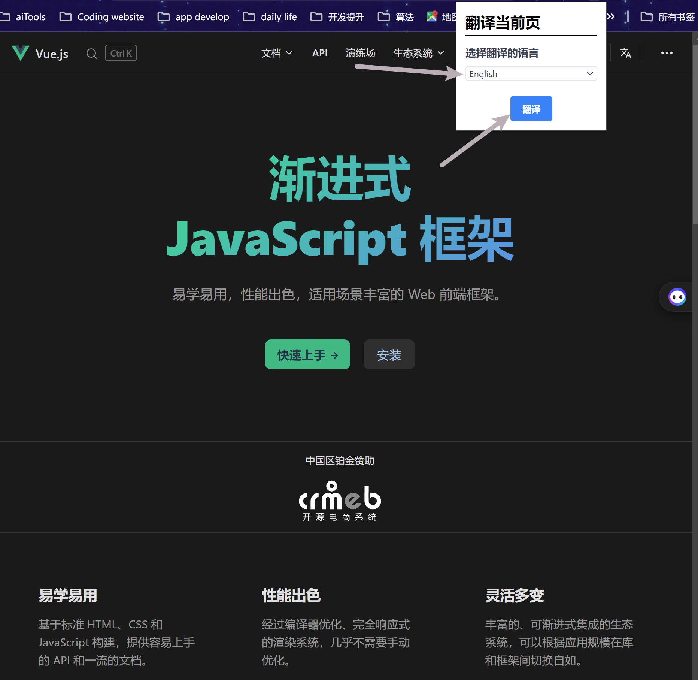

# Fibona AI Chrome Extension

## 运行方式

  1.pnpm install
  2.pnpm run dev
  3.在浏览器中导入构建好的Extension包

## 用法

### 功能一：智能总结、翻译

#### 1.选中浏览器中文本内容，弹窗自动弹出

##### 2.点击文本总结，即可开始总结所选中文本

##### 3.经过一段时间后显示总结返回的内容

##### 4.也可点击翻译按钮，即可开始翻译所选中文本（目前默认为中译英）

##### 5.等待一段时间后显示翻译完成的内容

### 功能二：侧边栏弹窗智能AI对话、快捷片段内容存储

#### 1.点击展开侧边栏按钮，自动弹出侧边栏

##### 2.在聊天框内输入内容，点击发送

##### 3.经过一段时间的等待

##### 4.返回结果

##### 5.在主界面点击快捷短语，进入快捷短语模块

##### 6.输入想要保存的内容，点击保存即可，并且还能够查看储存历史、进行复制或者删除功能

### 功能三：初步实现了自动注入脚本功能

#### 目前只是简单的写了一个自定义脚本，作用是点击屏幕后会弹出当前tab的主标题到当前页面上，3s后消失

### 功能四：初步实现了页面翻译功能

#### 1.点击展开侧边栏按钮，自动弹出侧边栏，选择想要翻译的目标语言

##### 2.点击确定，等待几秒钟即可翻译成功。

### 小特色

#### 简单使用了LangChain的TS模块，可以在提问之前为LLM提供更加高效的上下文、定制Prompt模板等

ps: 本来还想把Embedding多数据源加载、Retriever训练向量数据库等加上的，但是时间不够，只能作罢。
